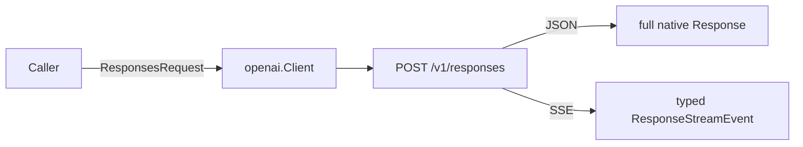

# OpenAI Responses API — Wrapper Design & Implementation

> **Wire baseline verified 2026-08-01.** Everything below describes the official `POST /v1/responses` surface as of that date, and what `openai` does with it. When the official API moves, follow the four-way sync in [architecture.md](../architecture.md) §6.

- **Official protocol**: OpenAI Responses API (`POST /v1/responses`; no standalone version number — keyed by the endpoint)
- **Official docs**: https://platform.openai.com/docs/api-reference/responses
  - create: https://platform.openai.com/docs/api-reference/responses/create
  - streaming events: https://platform.openai.com/docs/api-reference/responses-streaming
  - conversation state: https://platform.openai.com/docs/guides/conversation-state
  - hosted tools: [web search](https://platform.openai.com/docs/guides/tools-web-search) · [file search](https://platform.openai.com/docs/guides/tools-file-search) · [code interpreter](https://platform.openai.com/docs/guides/tools-code-interpreter)
- **Change log**: [openai-api-changes.md](./openai-api-changes.md)
- **Code**: `openai/responses.go` · `responses_wire.go` · `responses_events.go` · `responses_const.go`; root capability in `responder.go`

**How the baseline was verified.** `platform.openai.com` is not directly fetchable from the build environment, so the field-level inventory below was taken from OpenAI's own OpenAPI-generated type definitions — `openai/openai-python`, `src/openai/types/responses/`, commit `cbdc98b`, dated 2026-08-01 — which are generated from the same OpenAPI spec that backs the public reference. The links above are the human-readable source of record; re-check them, not this file, when syncing.

---

## 1. Scope and the two entry points

Responses is OpenAI's forward-looking interface: hosted tools, `previous_response_id` chaining, server-side conversations, reasoning items and cache controls land there, while Chat Completions stays supported but frozen. This SDK wraps it at **full fidelity**, as a second method set on the same client:

| Interaction form | Methods | Types |
|---|---|---|
| Chat Completions | `ChatCompletions` / `ChatCompletionsStream` | `ChatCompletionRequest` / `ChatCompletionResponse` |
| Responses | `Responses` / `ResponsesStream` | `ResponsesRequest` / `Response` / `ResponseStreamEvent` |

A new interaction form gets its own methods rather than widening the existing ones — the small-interface rule of [ADR 0002](../adr/0002-provider-native-as-the-only-public-interface.md) §6. This operation used to be reachable through a root `Responder` capability on a unified client; that client is gone, and the types it spoke were already these ones, so the migration is to call the same methods on `*openai.Client` directly.

Out of scope for this change: the Assistants API (retired), the Realtime API, background-response polling helpers, `GET`/`DELETE`/`cancel` on `/v1/responses`, conversation-resource CRUD, and hosted execution of anything beyond OpenAI's three first-party tools.

## 2. Endpoint, auth, and request lifecycle

```
POST {baseURL}/responses
Content-Type: application/json
Authorization: Bearer {apiKey}
```

`{baseURL}` is the client's base URL (default `https://api.openai.com/v1`). The caller's `*ResponsesRequest` is **never mutated**: `stream` is forced on a marshalled copy, so passing the same request value to `Responses` and then `ResponsesStream` is safe.



## 3. Request wire inventory (`ResponsesRequest`)

| Wire field | Go field | Notes |
|---|---|---|
| `model` | `Model` | Authoritative on this path — the unified client's default model is **not** applied |
| `input` | `Input *ResponseInput` | String **or** item array; build with `NewResponseTextInput` / `NewResponseItemsInput` |
| `instructions` | `Instructions` | System/developer message; not carried over by `previous_response_id` |
| `background` | `Background *bool` | Run the response in the background |
| `context_management` | `ContextManagement` | `[{type, compact_threshold}]` |
| `conversation` | `Conversation *ResponseConversation` | Object `{id}`; a bare ID string also decodes, and is re-encoded as an object. Mutually exclusive with `previous_response_id` |
| `previous_response_id` | `PreviousResponseID` | Multi-turn chaining |
| `include` | `Include []string` | See the `ResponseInclude*` constants; hosted-tool results are omitted unless requested |
| `max_output_tokens` / `max_tool_calls` | `MaxOutputTokens` / `MaxToolCalls` | |
| `metadata` | `Metadata` | ≤ 16 key/value pairs |
| `moderation` | `Moderation` | `{model, policy{input{mode}, output{mode}}}` |
| `parallel_tool_calls` | `ParallelToolCalls *bool` | |
| `prompt` | `Prompt` | Stored prompt template `{id, version, variables}` |
| `prompt_cache_key` / `prompt_cache_options` / `prompt_cache_retention` | same names | `prompt_cache_retention` is deprecated upstream in favour of `prompt_cache_options.ttl`; both stay on the wire |
| `reasoning` | `Reasoning` | `{context, effort, mode, summary, generate_summary}` |
| `safety_identifier` / `user` | same names | `user` is superseded by `safety_identifier` + `prompt_cache_key` |
| `service_tier` | `ServiceTier` | `auto` / `default` / `flex` / `scale` / `priority` / `fast` |
| `store` | `Store *bool` | |
| `stream` / `stream_options` | `Stream` / `StreamOptions` | `stream` is set by the client, not the caller; `stream_options.include_obfuscation` toggles the `obfuscation` padding on delta events |
| `temperature` / `top_p` / `top_logprobs` | same names | |
| `text` | `Text` | `{verbosity, format{type, name, schema, description, strict}}` |
| `tools` / `tool_choice` | `Tools` / `ToolChoice any` | §6 |
| `truncation` | `Truncation` | `auto` / `disabled` (default) |

Every enum-like value stays an open Go `string`, so a value newer than this SDK still passes through. The `ResponseToolChoice*` types cover the documented `tool_choice` object forms; the string forms (`none` / `auto` / `required`) go in directly.

## 4. Response wire inventory (`Response`)

`Response` carries every documented field of the response object: `id`, `object`, `created_at`, `completed_at`, `status`, `error`, `incomplete_details`, `instructions`, `model`, `output`, `conversation`, `previous_response_id`, `metadata`, `moderation`, the echoed generation controls (`temperature`, `top_p`, `top_logprobs`, `truncation`, `text`, `reasoning`, `tools`, `tool_choice`, `parallel_tool_calls`, `max_output_tokens`, `max_tool_calls`, `service_tier`, `store`-side cache fields), `usage` and `user`.

**Lifecycle and failure are preserved, never flattened.** `Responses` returns `(*Response, nil)` for a `failed` or `incomplete` response; the caller reads `Status`, `Error` and `IncompleteDetails`. Only transport failures and non-2xx HTTP responses become Go errors (§8).

| Status | Meaning |
|---|---|
| `queued` / `in_progress` | Still generating (background or streaming) |
| `completed` | Finished normally |
| `incomplete` | Stopped early — see `incomplete_details.reason` (`max_output_tokens`, `content_filter`) |
| `failed` | See `error.code` / `error.message` |
| `cancelled` | Cancelled by the caller |

**Usage.** `usage.input_tokens` / `output_tokens` / `total_tokens`, with `input_tokens_details.{cached_tokens, cache_write_tokens}` and `output_tokens_details.reasoning_tokens`. Note the shape differs from Chat Completions (`prompt_tokens` / `completion_tokens` and differently-named nested details) — the two are separate wire models and are not merged.

**`OutputText` is an SDK convenience, not a server field.** It is tagged `json:"-"`, derived at decode time by concatenating every `output_text` content part across `output` in order. The original items are untouched, and re-encoding a `Response` never emits it. Because it is computed at decode time, it does not follow later edits to `Output`.

## 5. Items and content parts

`output[]` (and the structured `input[]`) is a discriminated union. Known discriminators decode into a dedicated payload; **anything else keeps its verbatim payload** on `Raw` and is re-encoded byte-for-byte, so an item type newer than this SDK is never silently dropped.

| Discriminator | `ResponseInputItem` | `ResponseOutputItem` | Payload type |
|---|---|---|---|
| `message` | ✅ | ✅ | `ResponseInputMessage` (role + string-or-parts content) / `ResponseOutputMessage` (assistant, parts) |
| `reasoning` | ✅ | ✅ | `ResponseReasoningItem` — `summary[]`, `content[]`, `encrypted_content`, `status` |
| `function_call` | ✅ | ✅ | `ResponseFunctionToolCall` — `call_id`, `name`, `arguments`, `caller`, `namespace` |
| `function_call_output` | ✅ | ✅ | `ResponseFunctionCallOutput` — `call_id`, `output` (string **or** content parts) |
| `web_search_call` | raw | ✅ | `ResponseWebSearchCall` |
| `file_search_call` | raw | ✅ | `ResponseFileSearchCall` |
| `code_interpreter_call` | raw | ✅ | `ResponseCodeInterpreterCall` |
| `item_reference` | ✅ | raw | `ResponseItemReference` |
| everything else (`mcp_call`, `computer_call`, `image_generation_call`, `local_shell_call`, `custom_tool_call`, …) | raw | raw | preserved on `Raw` |

Content parts share a small field vocabulary, so one `ResponseContent` struct with a `type` discriminator covers them all: `input_text`, `input_image`, `input_file`, `input_audio` on the input side and `output_text`, `refusal`, `reasoning_text` on the output side, plus `summary_text` parts in reasoning summaries. `output_text` carries `annotations[]` (`file_citation`, `url_citation`, `container_file_citation`, `file_path`) and, when `message.output_text.logprobs` is included, `logprobs[]`. Citation indexes are `*int` so a legitimate `0` survives a round trip.

**Function calling is transported, never executed.** The SDK carries function definitions, `function_call` items and caller-supplied `function_call_output` items; running the caller's function is the caller's job ([ADR 0001](../adr/0001-keep-the-sdk-a-thin-wrapper.md)).

## 6. Hosted tools

`ResponseTool` is one flat struct with a `type` discriminator. The four modeled types decode into typed fields; any other tool type (`mcp`, `computer_use_preview`, `image_generation`, …) is preserved on `Raw` and re-encoded verbatim, so it can still be sent and read back.

| Tool | Request parameters | Result item |
|---|---|---|
| `function` | `name`, `description`, `parameters`, `strict`, `output_schema`, `allowed_callers`, `defer_loading` | `function_call` |
| `web_search` (alias `web_search_2025_08_26`) | `search_context_size`, `filters.allowed_domains`, `user_location{type, city, country, region, timezone}` | `web_search_call` with `action` = `search` (`query`, `queries`, `sources[]`), `open_page` (`url`), or `find_in_page` (`url`, `pattern`); sources need `include: ["web_search_call.action.sources"]` |
| `file_search` | `vector_store_ids`, `max_num_results`, `filters` (comparison/compound), `ranking_options{ranker, score_threshold, hybrid_search{embedding_weight, text_weight}}` | `file_search_call` with `queries[]` and, when `include: ["file_search_call.results"]`, `results[]{file_id, filename, score, text, attributes}` |
| `code_interpreter` | `container` (container ID string **or** `{type:"auto", file_ids, memory_limit, network_policy}`), `allowed_callers` | `code_interpreter_call` with `container_id`, `code`, and, when `include: ["code_interpreter_call.outputs"]`, `outputs[]` of `logs` / `image` |

## 7. Streaming

Responses streaming is a **typed SSE event protocol**, not the Chat Completions chunk protocol: each event has its own `type`, events are separated by a blank line, and there is **no `[DONE]` sentinel** — the stream ends when the body ends, which `Recv` reports as `io.EOF`.

`ResponseStream.Recv` honours SSE framing (blank-line boundaries, `:` comments/heartbeats, multi-line `data:` joined with `\n`), takes the discriminator from the payload `type` and falls back to the `event:` name, and always fills `Raw` with the verbatim payload. `Close` is idempotent, and the body is closed exactly once on every terminal path: `io.EOF`, an `error` event, a decode failure of a known event, a read failure, and an explicit `Close`.

`ResponseStreamEvent` is one struct: `Type` and `SequenceNumber` on every event, the coordinates the event applies to (`ItemID`, `OutputIndex`, `ContentIndex`, `SummaryIndex`, `AnnotationIndex`), the composite payloads decoded into their dedicated types (`Response`, `Item`, `Part`, `Logprobs`, raw `Annotation`), and the scalar increments/results (`Delta`, `Text`, `Refusal`, `Arguments`, `Code`, `Input`, `Name`, `Status`, `Obfuscation`, `PartialImageIndex`, `PartialImageB64`).

The documented baseline is 53 event types, returned by `openai.ResponseStreamEventTypes()`:

| Group | Events |
|---|---|
| Response lifecycle (carry `response`) | `response.created`, `response.in_progress`, `response.queued`, `response.completed`, `response.incomplete`, `response.failed` |
| Output item / content part (carry `item` / `part`) | `response.output_item.added`, `response.output_item.done`, `response.content_part.added`, `response.content_part.done` |
| Text, refusal, annotations, arguments | `response.output_text.delta`, `response.output_text.done`, `response.output_text.annotation.added`, `response.refusal.delta`, `response.refusal.done`, `response.function_call_arguments.delta`, `response.function_call_arguments.done`, `response.custom_tool_call_input.delta`, `response.custom_tool_call_input.done` |
| Reasoning | `response.reasoning_text.delta`, `response.reasoning_text.done`, `response.reasoning_summary_part.added`, `response.reasoning_summary_part.done`, `response.reasoning_summary_text.delta`, `response.reasoning_summary_text.done` |
| Hosted web search | `response.web_search_call.in_progress`, `.searching`, `.completed` |
| Hosted file search | `response.file_search_call.in_progress`, `.searching`, `.completed` |
| Hosted code interpreter | `response.code_interpreter_call.in_progress`, `.interpreting`, `.completed`, `response.code_interpreter_call_code.delta`, `response.code_interpreter_call_code.done` |
| Audio | `response.audio.delta`, `response.audio.done`, `response.audio.transcript.delta`, `response.audio.transcript.done` |
| Image generation | `response.image_generation_call.in_progress`, `.generating`, `.partial_image`, `.completed` |
| MCP | `response.mcp_call_arguments.delta`, `.done`, `response.mcp_call.in_progress`, `.completed`, `.failed`, `response.mcp_list_tools.in_progress`, `.completed`, `.failed` |
| Error | `error` |

An event type outside this list still reaches the caller with its `Type`, `SequenceNumber` and `Raw` intact — and, unlike a known event, a payload it cannot decode is tolerated rather than rejected. A **known** event that fails to decode is an error, so wire drift on a modeled shape is loud.

The `error` event is the one exception to "events are data": `Recv` turns it into an `*HTTPError` (with the raw payload on `Body`) and closes the stream, matching the native Chat Completions stream. `response.failed` is *not* an error — it is a lifecycle event carrying the failed `Response`.

## 8. Error handling

Non-2xx responses reuse the native client's bounded error reader and `*HTTPError` contract, unchanged from Chat Completions:

- the body is read under a 1 MB limit and kept verbatim on `HTTPError.Body`;
- a `{"error": {code, type, message}}` envelope fills `Code` / `Type` / `Message`; an unstructured body becomes `Message`;
- a read failure is reported as `Message: "failed to read error response"` with the cause on `Err`;
- stream setup closes the body before returning, so a failed `ResponsesStream` leaks nothing.

SSE scanning is bounded the same way (1 MB per line). A line beyond that limit surfaces as `openai: read responses stream: ...` rather than a truncated, valid-looking event.

## 9. Protocol capability notes

What this wrapper deliberately does not do on this path:

- **The chat methods do not widen.** Responses is its own method set, so nothing about it changes the Chat Completions request, response or stream.
- Multi-backend routing for Responses is provided by [vage/largemodel/composes/openais](https://github.com/vogo/vage), not by aimodel.
- **No client-side conveniences.** Requests are not validated, background responses are not polled, and nothing is retried — consistent with [ADR 0001](../adr/0001-keep-the-sdk-a-thin-wrapper.md).
- **Endpoint support is the server's business.** An OpenAI-*compatible* base URL is not assumed to implement `/responses`; a backend without the endpoint fails with its own HTTP error.

## 10. Tests

Offline only — no credentials, no network:

- `openai/responses_test.go` — request round-trip across every documented union (including unmodeled item and tool types), the complete-response fixture (ordered items, all three hosted tools, reasoning, function-call exchange, annotations, logprobs, usage details, derived `OutputText`), failed/incomplete preservation, `httptest` non-streaming call (path, headers, forced non-stream, caller immutability), the full 53-event SSE sweep, typed payload dispatch with multi-line data and comments, unknown-event preservation, terminal `io.EOF`, idempotent `Close`, `error` event, malformed known event, invalid JSON, oversized-line scan failure, and structured/unstructured non-2xx bodies.
- `openai/roundtrip_test.go` — every exported Responses wire type survives marshal → unmarshal → marshal unchanged, and no exported type is left unclassified.
- `integrations/openai_tests/native_responses_test.go` — runnable examples, non-streaming and streaming, skipped without `OPENAI_API_KEY` / `OPENAI_MODEL`.
